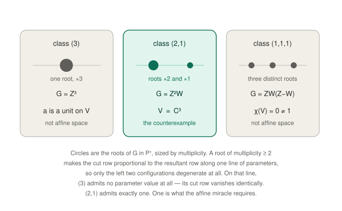

# jacobian

Two notes and a code repository about the Jacobian conjecture counterexample of Levent Alpöge (with
Claude Fable 5) — a systematic and empirically supported analysis keyed off the construction described in Terence
Tao's [digestion of the
counterexample](https://terrytao.wordpress.com/2026/07/21/a-digestion-of-the-jacobian-conjecture-counterexample/).

### [A cubic corollary](trichotomy.md)

For one cut in the (j,k) = (1,2) construction, the three classes of cubic
operator behave such that: **(3)** carries a nonconstant-unit obstruction,
**(2,1)** gives the affine miracle and Alpöge's counterexample, and
**(1,1,1)** carries an Euler-characteristic obstruction. Three short,
independent arguments using three different invariants.

### [Uniqueness of j = 1](uniqueness.md)

For Sym¹ × Sym^k with any number of linearly independent cuts and target
dimension at least three, the compactly supported Euler characteristic
satisfies χ(V) = (k−1)N. Since a counterexample requires χ(V) = 1, this
forces k = 2, one cut, class (2,1), with nonzero cut value — Alpöge's
configuration, uniquely.

### /[cleanroom](/cleanroom)

Verification code for both notes. Each note's own verification
section explains what the scripts establish — and what they do not.

---

Michael M. Ross · August 7, 2026 · michaelmross@cantab.net
